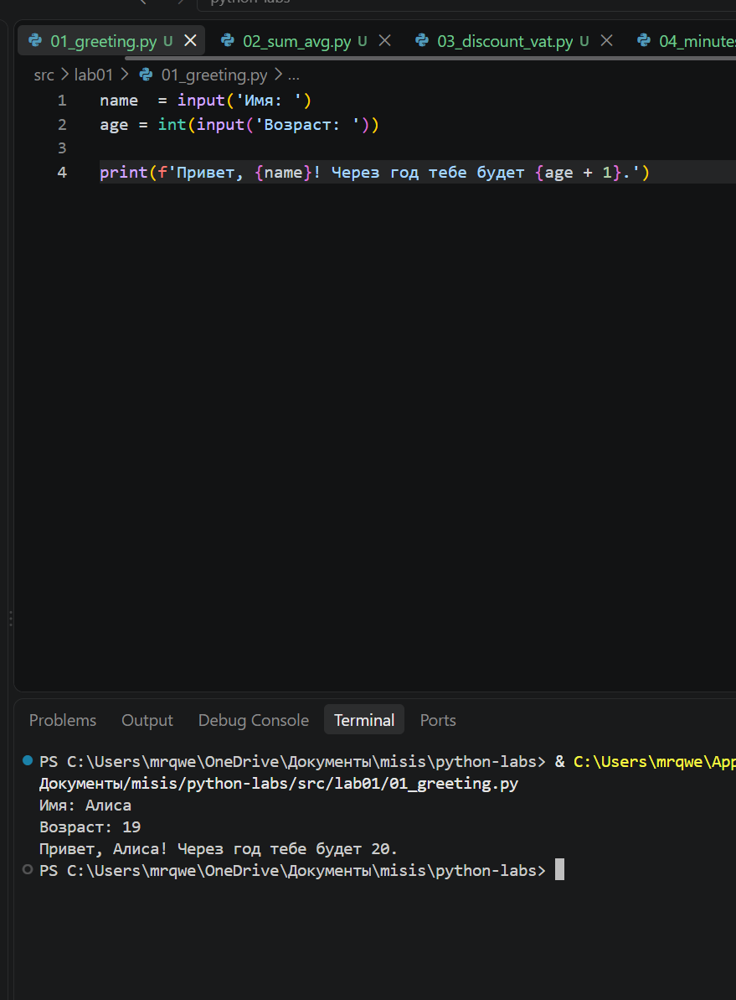
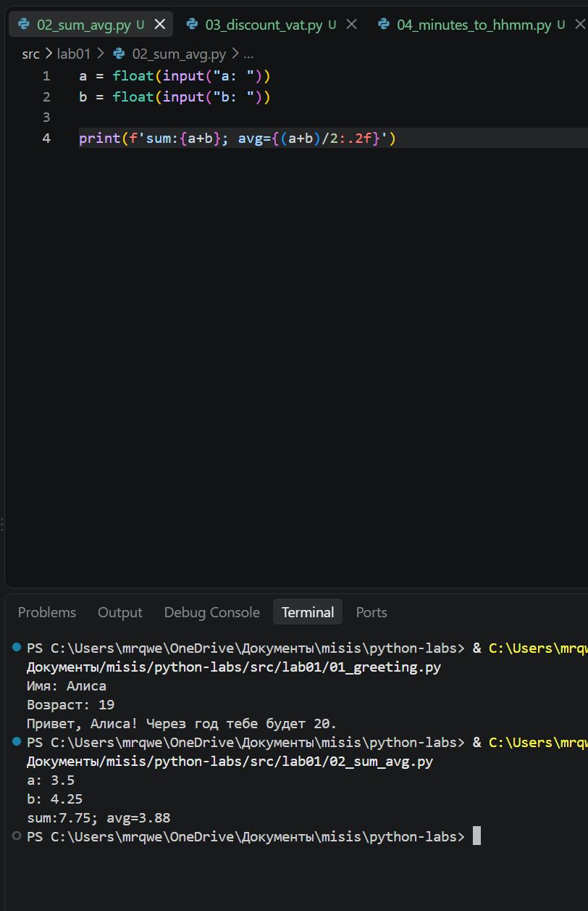
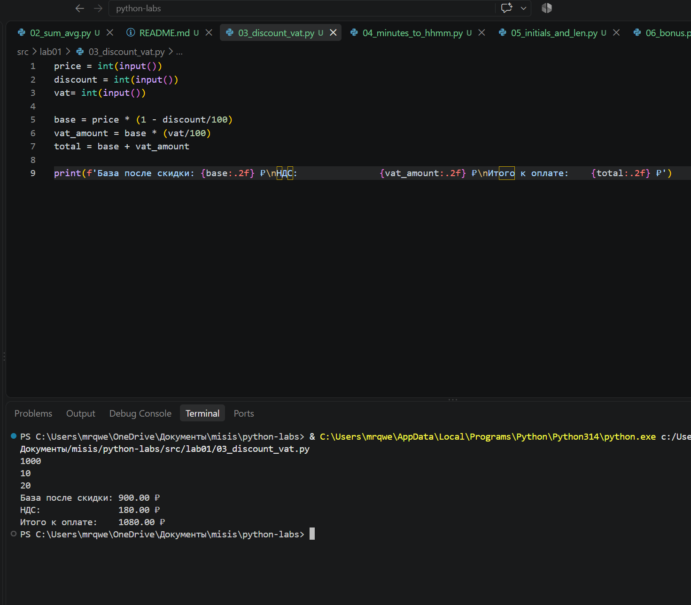
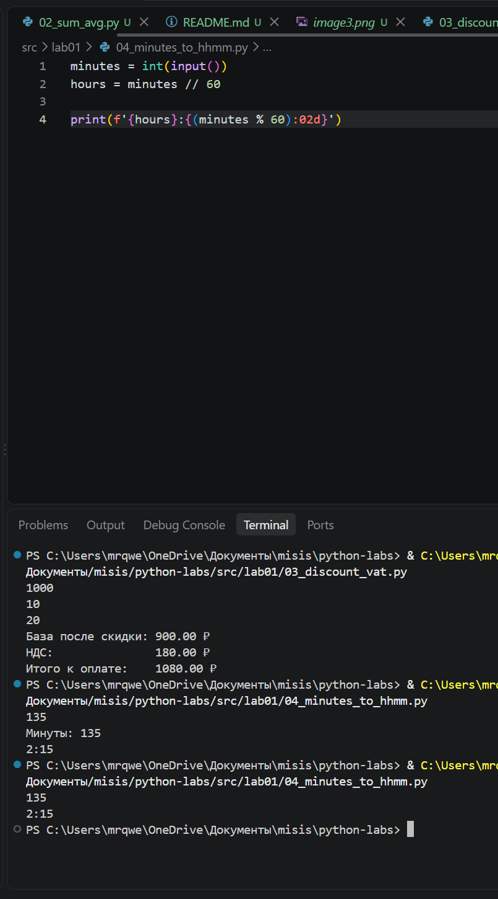
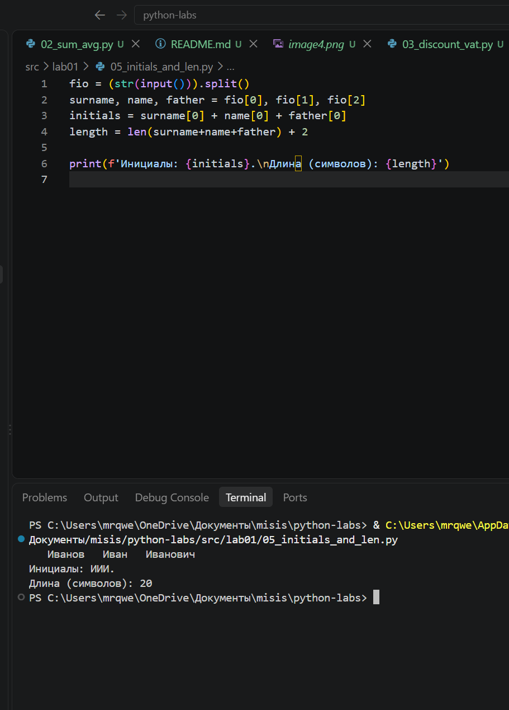
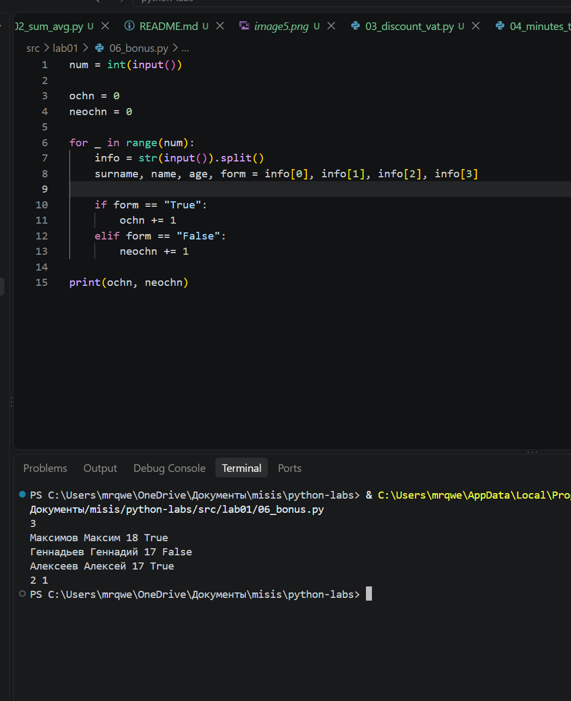
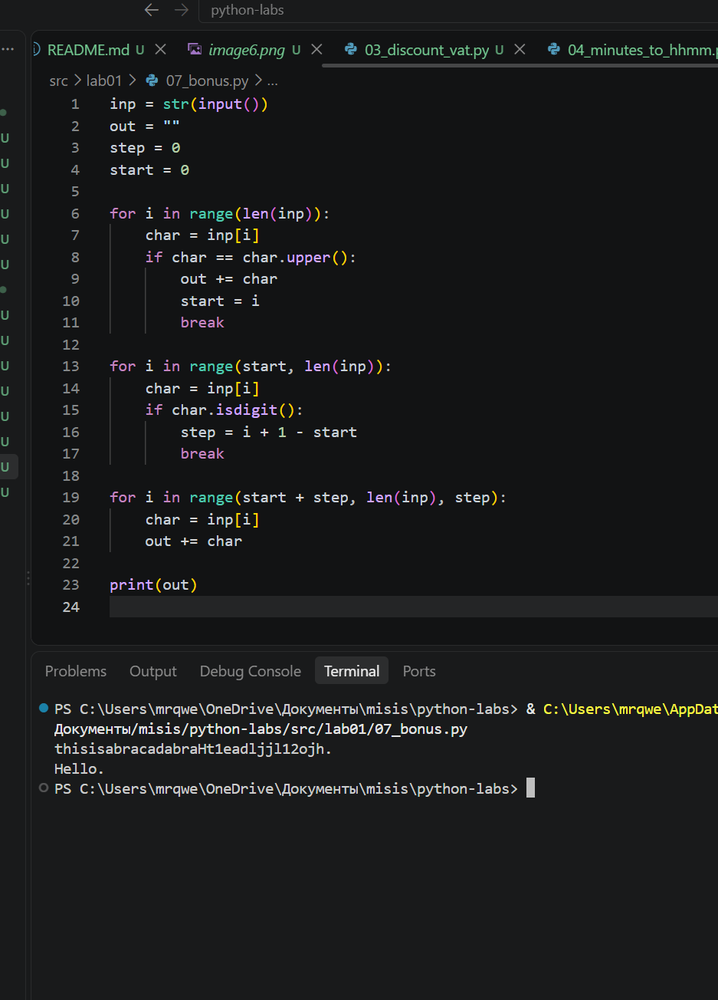

Ильичев Тимофей Алексеевич БИВТ 26-6-3

# Лабараторная работа 1

## Задание 1 — Приветствие
Спрашивает имя и возраст, потом здоровается и говорит сколько будет через год.

Сначала через input() и int() запрашиваем у пользователя имя и превращаем введенный возраст в число. Потом прямо внутри f-строки прибавляем к возрасту единицу и выводим готовый текст на экран.

Файл: src/01_greeting.py
Скрин: 

## Задание 2 — Сумма и среднее
Вводишь два числа, программа считает сумму и среднее.

Здесь через float(input()) принимаем от пользователя два числа и сразу превращаем их в дробные. В конце в одной f-строке складываем их, считаем среднее арифметическое и округляем результат до двух знаков после запятой с помощью :.2f.

Файл: src/02_sum_avg.py
Скрин: 

## Задание 3 — Скидка и НДС

Вводишь цену, скидку и НДС в процентах. Считает сколько платить в итоге.

Считываем три числа через int(input()), а затем по формулам высчитываем цену со скидкой, сумму НДС и итоговую стоимость. В конце выводим все три значения с новой строки (\n), округляя копейки до двух знаков через :.2f.

Файл: src/03_discount_vat.py
Скрин: 
## Задание 4 — Минуты в часы

Вводишь минуты, получаешь часы и минуты, типа 135 это 2:15.

Запрашиваем общее количество минут через int(input()) и делим его на 60 нацело (//), чтобы узнать часы. Минуты находим через остаток от деления (%), а в f-строке используем :02d, чтобы в выводе всегда было две цифры (например, 05 вместо 5).

Файл: src/04_minutes_to_hhmm.py
Скрин: 

## Задание 5 — Инициалы

Вводишь ФИО, программа делает из него инициалы и считает сколько символов в ФИО целиком.

Разбиваем введенную строку по пробелам через .split(), чтобы получить отдельные элементы для фамилии, имени и отчества. Затем вытаскиваем первые буквы для инициалов, складываем длины всех трех слов через len() и выводим результат в два столбика(+2 пробела внутри ФИО).

Файл: src/05_initials_and_len.py
Скрин: 

## Задание 6 — Студенты

Сначала пишешь сколько студентов, инфу про каждого. В конце показывает сколько очники и сколько заочники.

Сначала заводим счетчики для очников и заочников, а потом в цикле for крутимся столько раз, сколько ввел пользователь. На каждом шаге бьем строку через .split() по переменным и через обычный if-elif проверяем форму обучения, докидывая по единичке в нужный счетчик.

Файл: src/06.py
Скрин: 

## Задание 7 — Шифр

Расшифровывает слово.

Через первый цикл for находим первую заглавную букву строки, запоминаем её индекс и прерываемся. Во втором цикле ищем ближайшую цифру, чтобы по разнице индексов высчитать шаг, а в третьем цикле шагаем по строке с этим шагом и дописываем буквы в результат.

Файл: src/07.py
Скрин: 